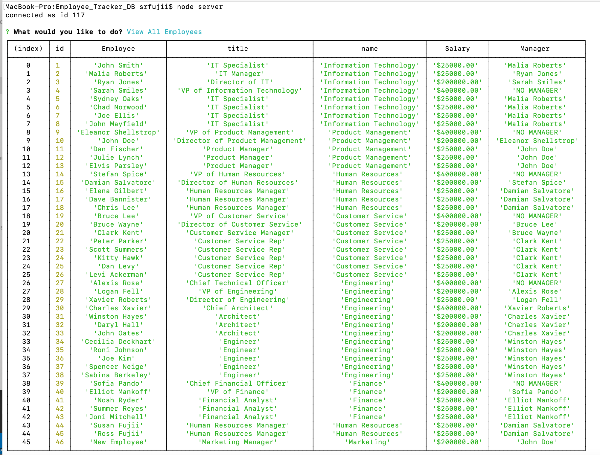
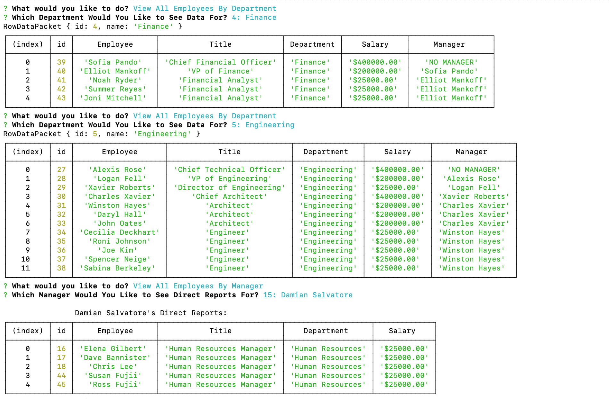
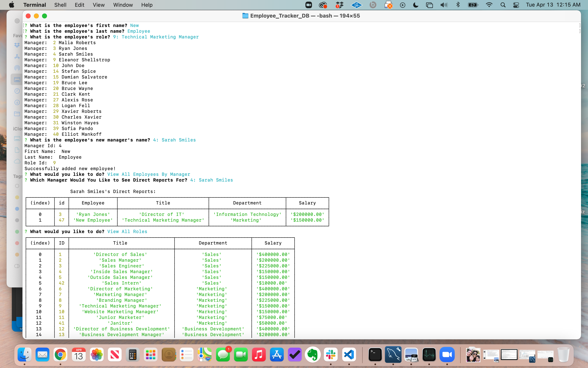
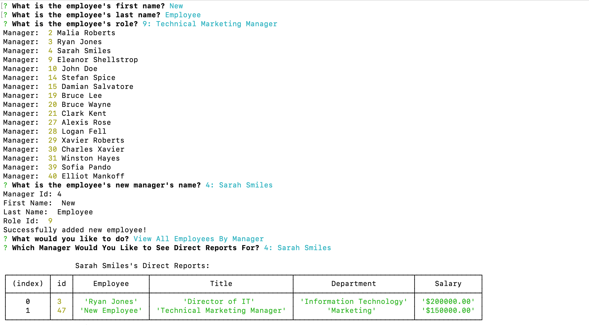
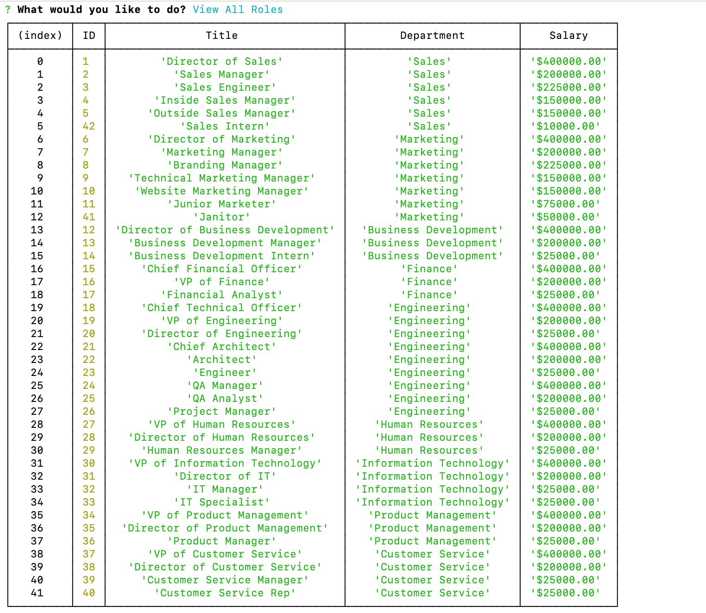
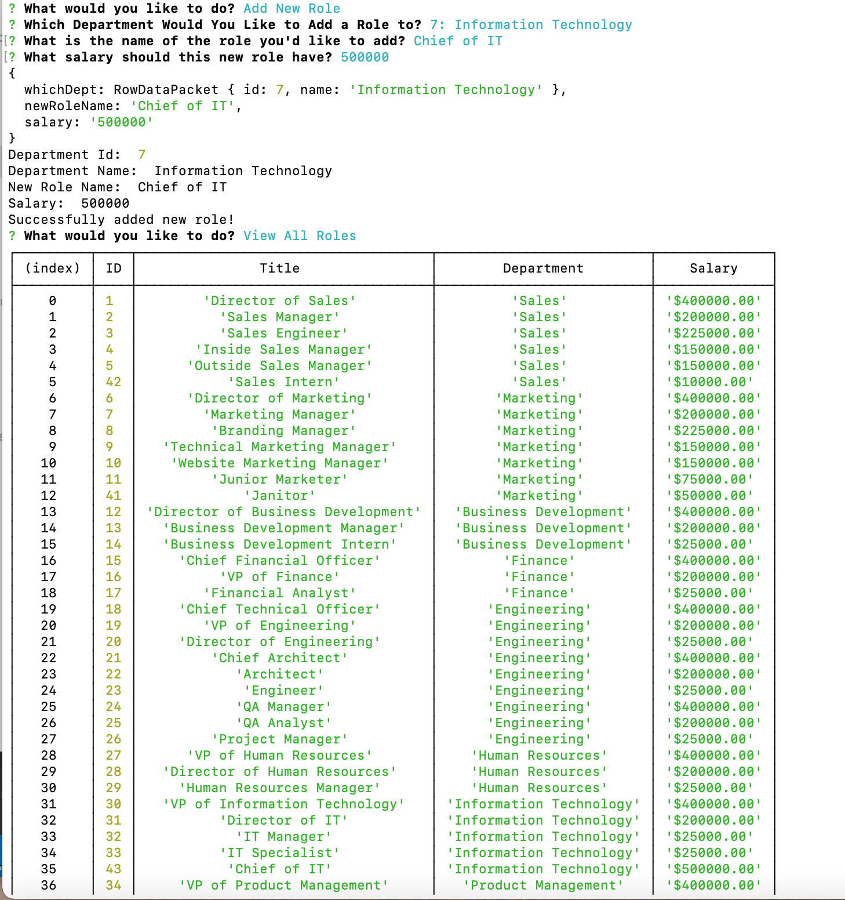
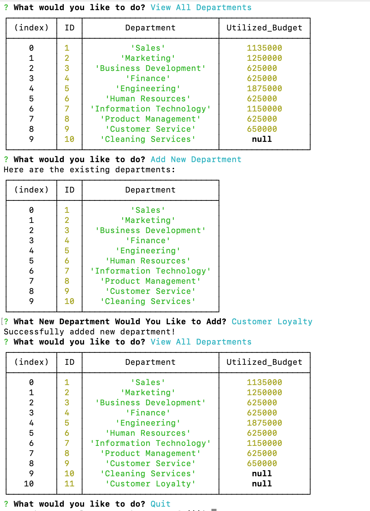

# Employee Tracker DB
  [](https://opensource.org/licenses/MIT)

  ## Description

  This employee tracker database makes it easy for non-developers to view and interact with information stored in the employee tracker database. This app is basically a Content Management System (CMS), where managers can view all of the information about their organization via a simple command-line interface. This app uses node, inquirer, and MySQL to deliver a robust command-line interface to an employee tracking database.

  ## Table of Contents

  * [Installation](#installation)
  * [Usage](#usage)
  * [Video](#video)
  * [Screenshots](#screenshots)
  * [License](#license)
  * [Contribute](#contribute)
  * [Tests](#tests)
  * [Questions](#questions)
 
  ## Installation

  To install necessary dependencies, run the following command:

  ```
  npm i
  ```

  ## Usage

  This is a student repo.

  ## Video

  Please click on the following link to see a walkthrough video of this application's functionality:

  [Screentastify Video](https://drive.google.com/file/d/1deLPX-FbL3Wp8ZpFNZmCF-r25bllDrs7/view)

  ## Screenshots

  
  
  
  
  
  
  

  ## License

  [](https://opensource.org/licenses/MIT) This project is licensed under the [MIT](https://opensource.org/licenses/MIT) license.

  ## Contribute

  Contributions are always welcome! (Please fork and pull request only.)

  ## Tests

  To run tests, run the following command: 

  ```
  npm test
  ```

  ## Questions

  If you have any questions about the repo, open an issue or contact me directly at susan.fujii@me.com. You can find more of my work at [srfujii](https://github.com/srfujii/).

